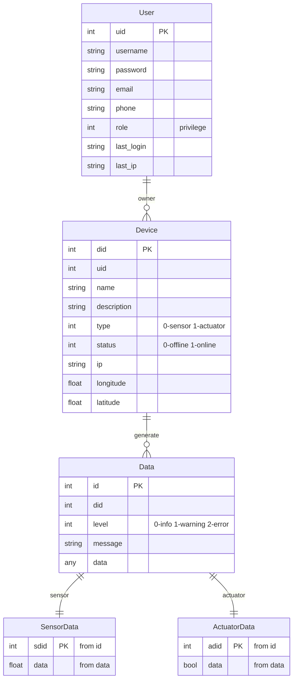

# Design

## 0 Purpose

> This is the English version of the demand in assignment

The basic functions that need to be implemented are as follows: 

1. Build an mqtt server that can receive data sent by the specified IoT terminal emulator. 
2. Implement user registration and login functions. Users need to fill in necessary information and verify when registering, such as user name and password. It is required to be more than 6 bytes, verify the email format, and ensure that the user name and email are unique in the system. After the user logs in The following operations are possible. 
3. Provide a device configuration interface to create or modify device information, including necessary information, such as device ID, device name, Equipment type, etc. 
4. Provide a query and statistics interface for data reported by the device 
5. Provide a map interface to display device information, distinguish between normal and alarm information, and historical data of some device types can be displayed. Cheng q historical trajectory 
6. The homepage provides statistical information (total equipment, total online, received data, etc.), displayed in charts (columns, Line chart, etc.) 
7. Enhancements: The style is adapted to the mobile phone and can be displayed friendly in the built-in browser of mobile browsers/WeChat and other applications. 

P.S.: In order to facilitate job submission, it is recommended to use mysql or mangodb as the database used by the project. When submitting the job, Comes with script files or data for building databases and tables.


## 1 Demand Analysis

The purpose can be divided into three part:

1. A **mqtt server** which can get the data from device simulator and save it into the database
2. A **backend server** which offers the api for the website to get data
3. A **frontend website** for showing the data and offer some enhance view

### MQTT Server

There are three part in mqtt, server, publisher and subscriber. To reduce the complexity of the project and enhance convinience, using <u>a free open server</u> is a better choice. So choosing the `broker.emqx.io:1883` as the server to be used in project. Also, the device simulator is the publisher, so what is needed is the <u>subscriber.</u>

Because the device number and message may change with the user demand, so the subscriber should have <u>a update state function</u> to update the topic it subscribes.

> To better test the project, there may need mock to perform like the device simulator.

### Backend Server

Because there is demand to show the message from device, device and user, it is needed to <u>offer apis</u> for the frontend website.

There should be <u>three main entity</u> in database, data, device and user. Also, apis should be designed accordingly.

> Because the panel is a control panel, there should be some initialized user to login the panel.

### Frontend website

The frontend website is for showing the message stored in the database. Its main pages should contain three different entities above.


## 2 Data model




## 3 API design

To better show information, define some items

All response are in below formal

```json
{
    'code': Integer,
    'token': String,
    'message': String,
    'data': Any
}
```

So below api map only show what in data field

Also, use `user` as a struct of user item, `device` as a struct of device item and `data` as a struct of data item (items definition can be seen above) for short. And `need-token` means the api requires a token generate by login.

### User

> Parent path: `\user`

| Path         | Type | `need-token` | Request                         | Response     |
| ------------ | ---- | ------------ | ------------------------------- | ------------ |
| add          | POST | yes          | `user`                          | `user`       |
| delete/{uid} | POST | yes          |                                 |              |
| info         | GET  | yes          |                                 | `user`       |
| list         | GET  | yes          |                                 | `list[user]` |
| login        | GET  | no           |                                 | `user`       |
| login        | POST | no           | `user.username`&`user.password` | `user`       |
| logout       | GET  | no           |                                 |              |
| update       | POST | yes          |                                 | `user`       |

### Device

> Parent path: `\device`

| Path         | Type | `need-token` | Request  | Response       |
| ------------ | ---- | ------------ | -------- | -------------- |
| add          | POST | yes          | `device` | `device`       |
| data/{did}   | GET  | yes          |          | `list[data]`   |
| delete/{did} | POST | yes          |          | `device`       |
| info/{did}   | GET  | yes          |          | `device`       |
| list         | GET  | yes          |          | `list[device]` |
| update/{did} | POST | yes          | `device` | `device`       |

### Data

> Parent path: `\device`
>
> The same parent path to reduce path branch

| Path         | Type | `need-token` | Request        | Response      |
| ------------ | ---- | ------------ | -------------- | ------------- |
| dataList     | POST | yes          | `selectOption` | `list[data]`  |
| dataYearLsit | GET  | no           |                | `list[years]` |

 

## 4 Demo show


